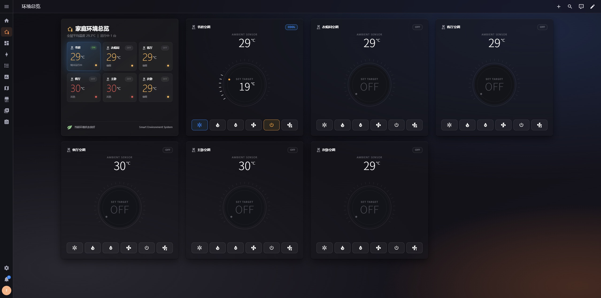
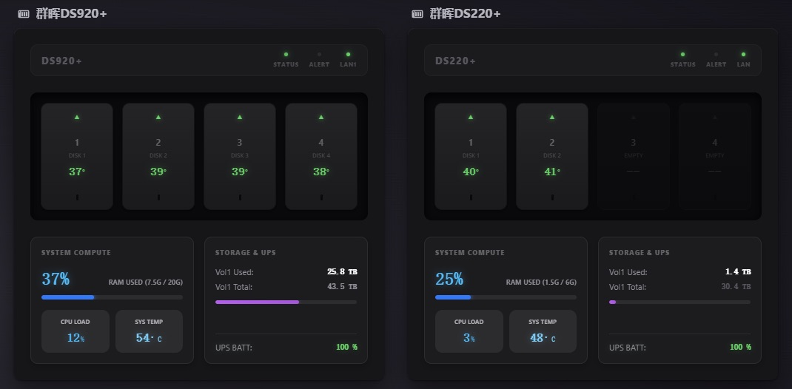
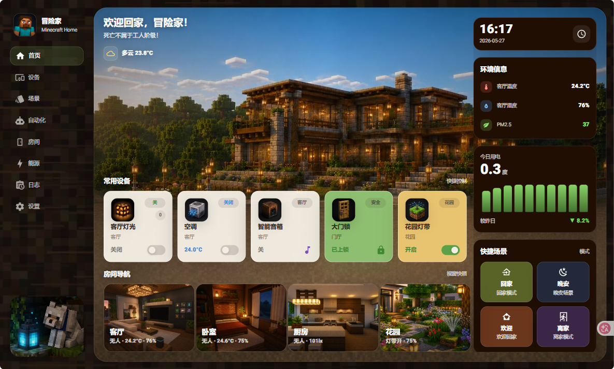
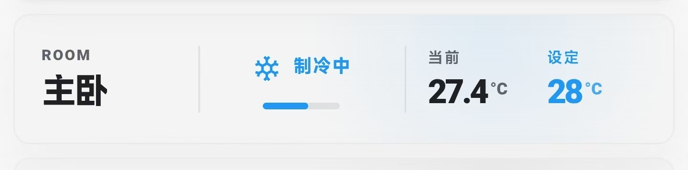

# HTML Card Store

为 Home Assistant 提供美观的 HTML 卡片商店，让你轻松浏览、安装和管理精美的仪表板卡片。

## 特别感谢

本项目的界面和功能设计参考了 [html-card-pro](https://github.com/ha-china/html-card-pro) 的优秀实现，在此对 html-card-pro 作者表示最诚挚的感谢和肯定！

html-card-pro 提供了优雅的代码编辑器、语法高亮和流畅的交互体验，是本项目的重要灵感来源。没有 html-card-pro 的优秀工作，就不会有这个项目的现在。

## 功能特性

- 📦 **卡片商店** - 浏览预定义的精美卡片
- ➕ **一键安装** - 一键将卡片安装到你的仪表板
- ✏️ **代码编辑** - 内置代码编辑器（依赖 html-card-pro）
- 💾 **自定义模块** - 保存和管理你自己的卡片
- ⭐ **收藏功能** - 收藏你喜欢的卡片
- 📋 **复制代码** - 快速复制卡片代码

## 安装

### 通过 HACS 安装（推荐）

1. 打开 HACS
2. 点击 `自定义仓库`
3. 添加仓库 URL 并选择 `集成` 类别
4. 搜索 `HTML Card Store` 并安装

### 手动安装

1. 将 `custom_components/html_card_store` 目录复制到你的 Home Assistant 配置目录下的 `custom_components` 文件夹中
2. 重启 Home Assistant
3. 在 `设置` → `设备与服务` → `添加集成` 中搜索 `HTML Card Store` 并添加

## 使用说明

1. 安装集成后，侧边栏会出现一个新的 `商店` 入口
2. 点击进入卡片商店，浏览可用的卡片
3. 点击卡片可以查看预览和代码
4. 点击 `安装到仪表盘` 可以快速将卡片添加到你的仪表板
5. 点击 `✏️ 展开编辑` 可以编辑卡片代码

## 依赖

本项目的代码编辑器功能依赖于 [html-card-pro](https://github.com/ha-china/html-card-pro)。如果尚未安装，系统会提示你安装。

## 配置

集成支持通过配置流程设置：
- 仪表板 URL 路径
- 仪表板标题
- 是否在侧边栏显示

## 截图

## 支持与反馈

如果你在使用过程中遇到问题或有建议，欢迎提交 Issue。

## 许可证

MIT License
